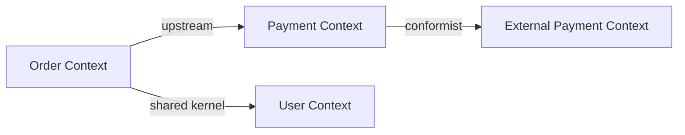

# /relay:dev:ddd-design

도메인 모델과 유비쿼터스 언어를 설계합니다. **dev 도메인 전용** 스킬입니다.

## 사전 확인

`domain-config.json` 에서 `active_packs` 에 `dev` 가 포함되어 있는지 확인합니다.
포함되지 않으면: "이 스킬은 development 도메인에서만 사용 가능합니다. `/relay:setup` 으로 변경하세요."

## 사용 주체

`steering-orchestrator` (상위팀)

## 수행 내용

### 1. 유비쿼터스 언어 사전 작성

비즈니스 용어와 기술 용어의 불일치를 제거합니다.

```markdown
## 유비쿼터스 언어 사전

| 용어 | 정의 | 잘못된 표현 |
|---|---|---|
| Order | 고객이 상품을 구매하는 단위 | 주문서, request |
| OrderItem | Order 안의 개별 상품 | item, product_line |
```

### 2. 바운디드 컨텍스트 맵



### 3. 애그리게이트 설계

각 애그리게이트의 루트, 엔티티, 값 객체, 도메인 이벤트를 정의합니다.

## 저장 형식

파일: `.claude/relay/shared-context/domain-models/DOMAIN-{Context}.md`

```markdown
---
context: {컨텍스트명}
version: 1
updated_at: {YYYY-MM-DD}
---

# {Context} 도메인 모델

## 유비쿼터스 언어

| 용어 | 정의 |
|---|---|

## 바운디드 컨텍스트


## 애그리게이트

### {AggregateRoot}
- 엔티티: {목록}
- 값 객체: {목록}
- 도메인 이벤트: {목록}
```

## 완료 후

DOMAIN 파일이 생성되면 팀 리더에게 알리고 `/relay:dev:create-implementation-plan` 을 실행하도록 안내합니다.
