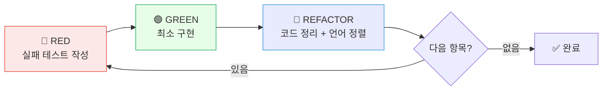

# /relay:dev:tdd-cycle

TDD 사이클 단계를 기록하고 PLAN 파일 체크박스를 업데이트합니다. **dev 도메인 전용** 스킬입니다.

## 사용법

```
/relay:dev:tdd-cycle RED      "결제 도메인 엔티티 생성 테스트"
/relay:dev:tdd-cycle GREEN    "결제 도메인 엔티티 생성 테스트"
/relay:dev:tdd-cycle REFACTOR "결제 도메인 엔티티 생성 테스트"
```

## 사이클 흐름



## 각 단계 수행 내용

### 🔴 RED

1. 구현 없이 실패하는 테스트 작성
2. 테스트 실행 → 실패 확인
3. PLAN 파일에서 해당 `🔴 RED` 체크박스 체크
4. 리더에게 RED 완료 보고

### 🟢 GREEN

1. 테스트를 통과하는 **최소한의** 구현
2. 테스트 실행 → 통과 확인
3. PLAN 파일에서 해당 `🟢 GREEN` 체크박스 체크

### 🔵 REFACTOR

1. 중복 제거, 네이밍 개선, 설계 정리
2. 유비쿼터스 언어 정렬 (DOMAIN-{ctx}.md 참조)
3. 모든 테스트 재실행 → 통과 확인
4. PLAN 파일에서 해당 `🔵 REFACTOR` 체크박스 체크
5. 리더에게 완료 보고

## 금지 규칙

- 🔴 RED 없이 🟢 GREEN 작성 금지
- 🔵 REFACTOR 없이 다음 🔴 RED 진행 금지
- 테스트 없는 구현 금지

## PLAN 체크박스 업데이트

PLAN 파일 경로: `.claude/relay/shared-context/implementation-plans/PLAN-{팀슬러그}-{DDL번호}.md`

해당 항목의 체크박스를 `- [ ]` → `- [x]` 로 변경합니다.
