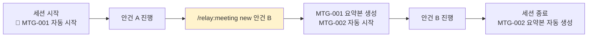

# /relay:meeting

회의록을 제어합니다.

> **세션 시작 → 🔴 대화록 자동 시작 / 세션 종료 → 📄 요약본 자동 생성**
> `/relay:meeting start` 와 `/relay:meeting stop` 은 필요 없습니다.

## 파일 명명 규칙

```
.claude/relay/meetings/
  {YYYY-MM-DD}_{팀ID}_{NNN}_transcript.md   ← 대화록
  {YYYY-MM-DD}_{팀ID}_{NNN}_summary.md      ← 요약본
  ACTIVE.json                                ← 진행 중 플래그 (자동 생성/삭제)
```

날짜를 앞에 두면 `ls` 결과가 시간순으로 자동 정렬됩니다.

## 발언 기록 방식

에이전트 발언은 두 가지 경로로 기록됩니다:

**자동 (기본)**: TeammateIdle 훅이 각 턴 종료 시 자동으로 전송합니다.
```
SendMessage("meeting-recorder", "{역할명}: {발언 내용}")
```

**수동**: 즉시 기록이 필요한 중요 결정에만 사용합니다.
```
SendMessage("meeting-recorder", "{역할명}: {발언 내용}")
```
또는 레거시 방식:
```
/relay:meeting log "{역할명}" "{발언 내용}"
```

## 명령 목록

| 명령 | 사용 주체 | 동작 |
|---|---|---|
| `/relay:meeting new [안건]` | 누구나 | 현재 회의 마무리 → 새 회의 즉시 시작 |
| `/relay:meeting off` | 누구나 | 이 세션에서 기록 비활성화 |
| `/relay:meeting on` | 누구나 | 기록 재활성화 |
| `/relay:meeting topic [안건]` | 누구나 | 현재 회의 안건 업데이트 |
| `/relay:meeting summary` | 누구나 | 중간 요약본 즉시 생성 (기록 계속) |
| `/relay:meeting log "X" "Y"` | 에이전트 | X의 발언 Y를 대화록에 추가 (레거시) |
| `/relay:meeting status` | 누구나 | 현재 상태 + 발언 수 + 파일 위치 |
| `/relay:meeting list` | 누구나 | 저장된 회의록 목록 |

## /relay:meeting new 흐름



## 대화록 vs 요약본

| 구분 | 대화록 | 요약본 |
|---|---|---|
| 내용 | 모든 발언 원문 (가감 없음) | 결정·액션아이템·미결사항 |
| 생성 | 세션 시작 시 자동 | 세션 종료 시 자동 |
| 수정 | ❌ 불가 | ✅ `/relay:meeting summary` 로 재생성 |
