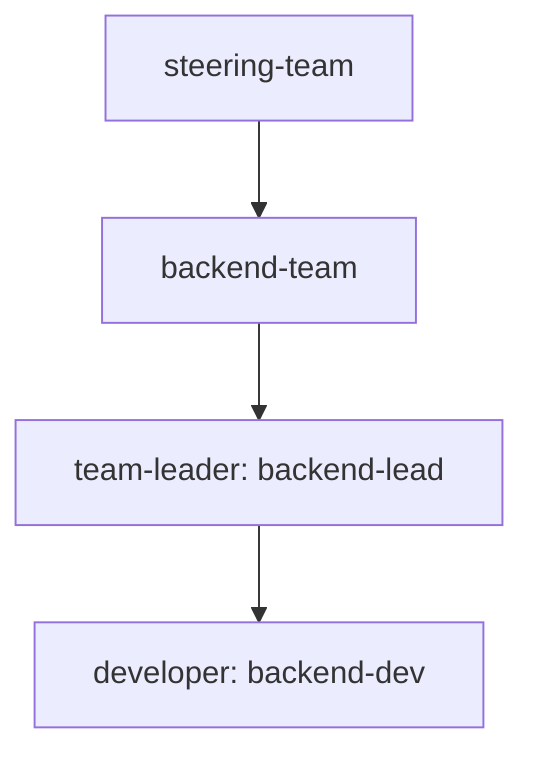
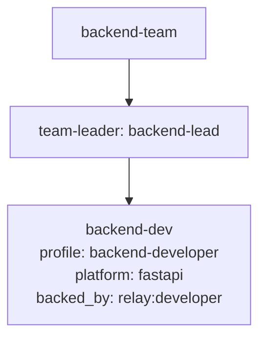

# /relay:visualize-team

현재 저장된 팀 구성 파일과 전문가 정의 파일을 읽어 Mermaid 다이어그램으로 시각화합니다.

## 목적

- `.claude/relay/teams/*.json` 에 저장된 현재 팀 구조를 빠르게 파악합니다.
- 상위팀, 하위팀, 리더, 팀원, 브릿지 연결을 한눈에 봅니다.
- 필요하면 `backed_by`, `agent_profile`, `default_platform` 같은 실행 메타데이터도 함께 표시합니다.

## 사전 확인

다음 순서로 확인합니다.

1. `.claude/relay/domain-config.json`
2. `.claude/relay/teams/`
3. `.claude/relay/experts/`

팀 파일이 없으면 `/relay:build-team` 을 먼저 실행하도록 안내합니다.

## 입력 해석

사용자 요청에서 다음 범위를 해석합니다.

- 특정 팀만 보고 싶은지
- 전체 팀 구조를 보고 싶은지
- 단순 구조만 볼지, 실행 메타데이터까지 함께 볼지

기본값은 `전체 팀 구조 + 단순 구조` 입니다.

## 데이터 읽기 규칙

### 팀 파일

`.claude/relay/teams/{slug}.json` 에서 다음을 읽습니다.

- `name`
- `slug`
- `type`
- `members`
- `bridge_to`
- `decision_mode`

### 전문가 파일

각 멤버의 `expert_slug` 로 `.claude/relay/experts/{slug}.md` 를 읽고 다음을 보강합니다.

- `role`
- `backed_by`
- `agent_profile`
- `default_platform`

## 출력 규칙

기본 출력은 Mermaid `graph TD` 입니다.

- 상위팀과 하위팀 관계를 표시합니다.
- 팀 아래에 리더와 팀원을 표시합니다.
- `bridge_to` 가 있으면 점선 연결로 표시합니다.
- `backed_by` 또는 `agent_profile` 표시 요청이 있으면 노드 라벨에 함께 적습니다.

## 기본 다이어그램 형식



## 확장 다이어그램 형식

실행 메타데이터까지 표시하는 경우:



## 표시 규칙

- `upper` 팀은 상단에 둡니다.
- `lower` 팀은 해당 `bridge_to` 또는 연결된 상위팀 아래에 둡니다.
- 리더는 팀 바로 아래에 둡니다.
- 일반 팀원은 리더 아래에 둡니다.
- `is_leader: true` 가 여러 명이면 모두 리더 레벨에 표시합니다.

## 응답 형식

사용자에게 다음 두 가지를 제공합니다.

1. 짧은 요약
2. Mermaid 코드 블록

예시:

```text
현재 3개 팀이 정의되어 있습니다. 상위팀 1개, 하위팀 2개입니다.
```


## 후속 안내

필요하면 다음도 제안합니다.

- 특정 팀만 다시 도식화
- 실행 메타데이터 포함 도식화
- 팀 구조 변경 후 재시각화
