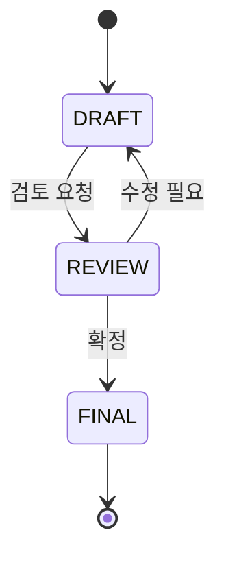

# /relay:write-design-decision

설계 결정을 DDL(Design Decision Log) 파일로 문서화합니다. **상위팀 전용** 스킬입니다.

## 사용 주체

`steering-orchestrator`, 상위팀 구성원

## DDL 파일 생성

파일: `.claude/relay/shared-context/design-decisions/DDL-{NNN}-{slug}.md`

```markdown
---
id: DDL-{NNN}
title: {결정 제목}
status: DRAFT | REVIEW | FINAL
date: {YYYY-MM-DD}
author: {역할명}
affects: [{영향받는 팀}]
---

# DDL-{NNN}: {결정 제목}

## 배경
{이 결정이 필요하게 된 컨텍스트}

## 결정 내용
{구체적인 결정 사항}

## 근거
{왜 이 방향을 선택했는가}

## 대안
{검토했으나 선택하지 않은 방법과 이유}

## 영향 범위
{어떤 팀·컴포넌트·인터페이스에 영향을 주는가}

## 후속 작업
- [ ] {팀명}: {해야 할 일}
```

## 상태 흐름



FINAL 상태가 되면 팀 리더가 `/relay:dev:create-implementation-plan` 을 실행합니다.

## 완료 후

영향받는 팀 리더에게 DDL 번호와 내용을 공유합니다.
