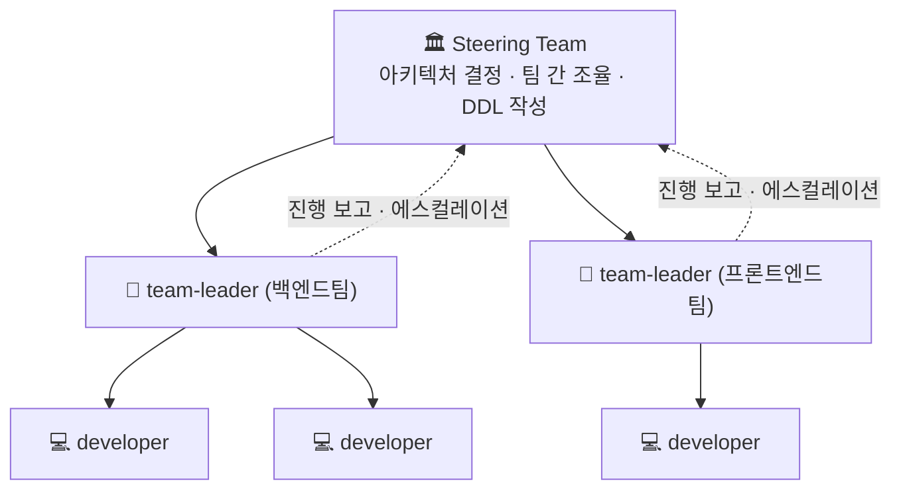
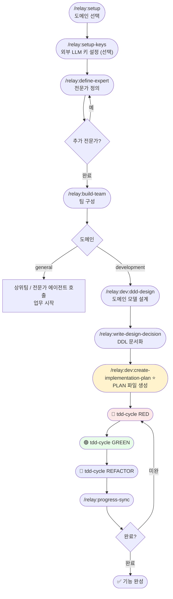
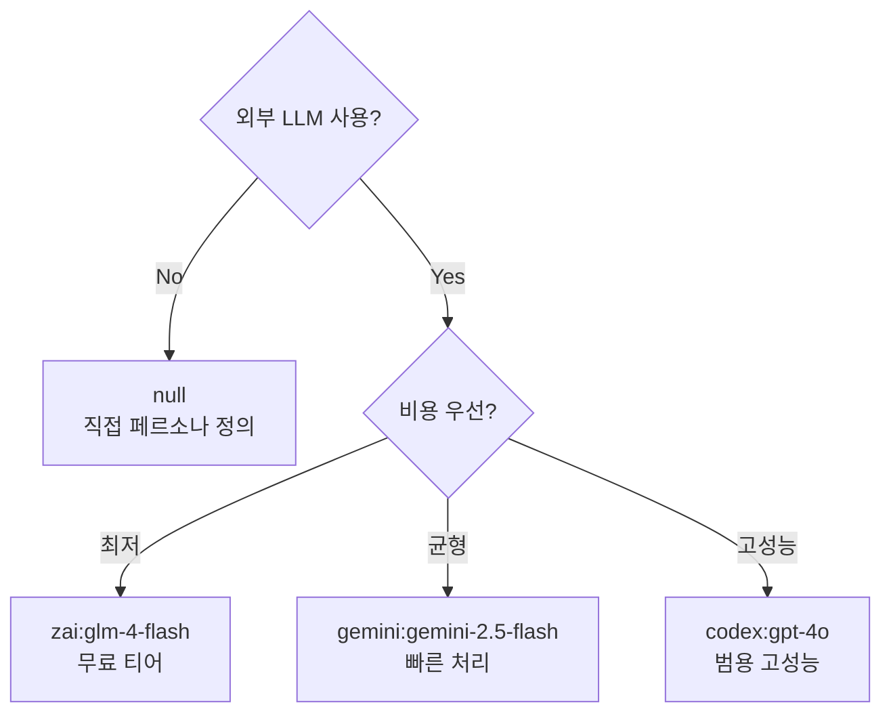
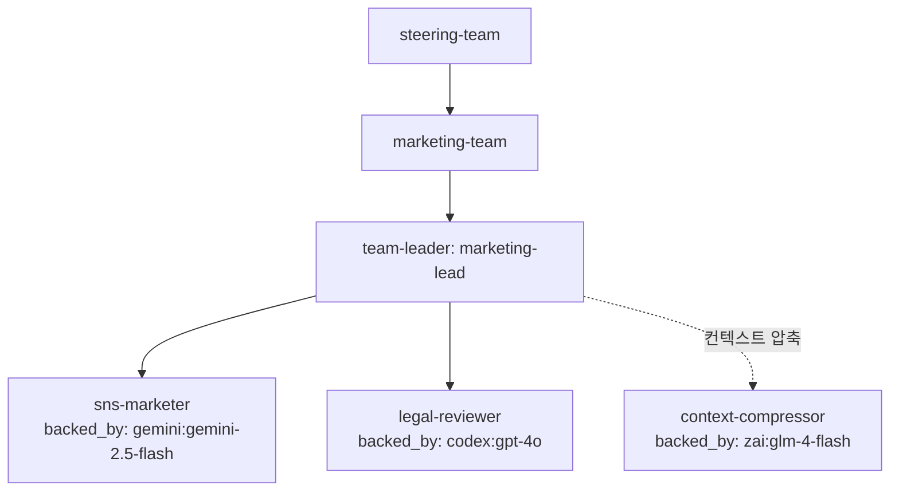
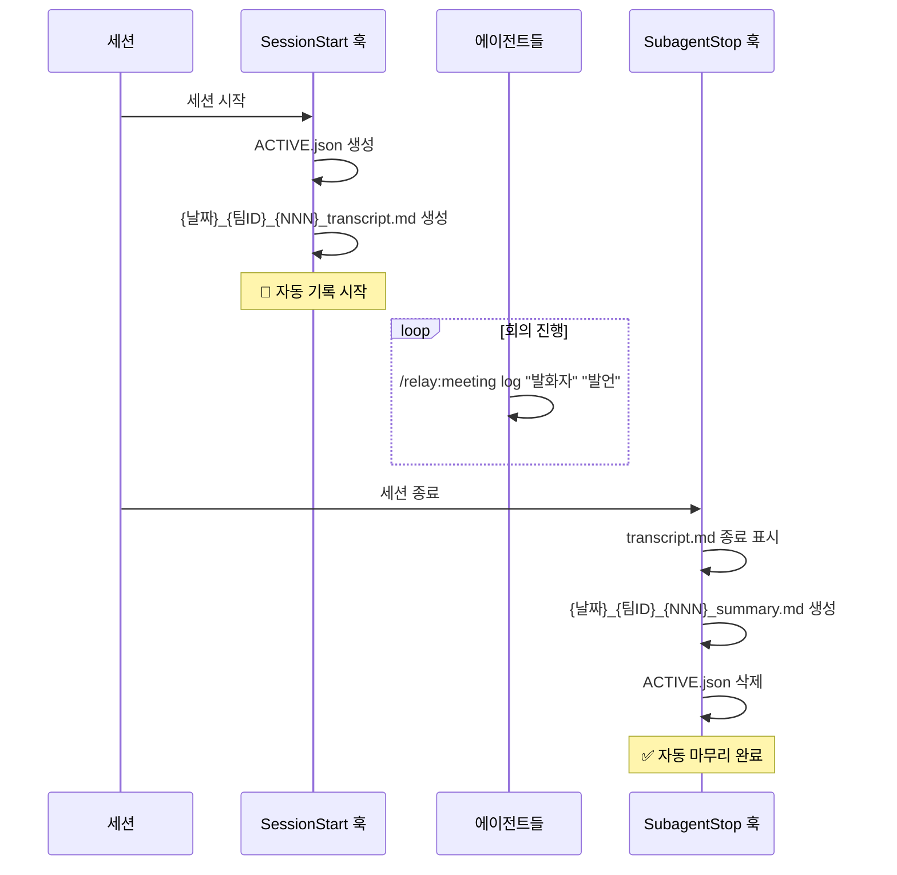

# relay

> **프롬프트 기반 계층형 에이전트 팀 프레임워크**

사용자 정의 전문가와 계층형 팀 구조를 **프롬프트만으로** 유연하게 설계·운용하는 Claude Code 확장.

**특징**: 코드 없이, 지침과 명령어만으로 작동합니다.

**지원 LLM**: Claude (기본), Google Gemini, OpenAI GPT, Zhipu AI GLM

---

## 목차

1. [설치](#설치) — 플러그인 설치 · 초기화 · 외부 LLM 설정
2. [빠른 시작](#빠른-시작)
3. [핵심 개념](#핵심-개념)
4. [전문가 백엔드 — backed_by](#전문가-백엔드--backed_by)
5. [MCP 기반 외부 LLM 전문가](#mcp-기반-외부-llm-전문가)
6. [실행 모드 — in-process / teammate / subagent](#실행-모드--in-process--teammate--subagent)
7. [context-compressor — 컨텍스트 압축 시스템](#context-compressor--컨텍스트-압축-시스템)
8. [사용 방법](#사용-방법)
9. [팀 구조 시각화](#팀-구조-시각화)
10. [스킬 레퍼런스](#스킬-레퍼런스)
11. [회의록](#회의록)
12. [데이터 저장 구조](#데이터-저장-구조)
13. [플러그인 구조](#플러그인-구조)
14. [제한사항](#제한사항)

---

## 설치

```bash
# 마켓플레이스 등록 (최초 1회)
claude plugin marketplace add yarang/relay-plugin

# 플러그인 설치
claude plugin install relay@relay-plugin
```

설치 후 `/relay:setup` 으로 시작합니다. 저장소 구조와 수동 설치는 **[저장소 루트 README](../README.md)** 를 참조하세요.

---

## 빠른 시작

### 일반팀 (general)

```
1. /relay:setup              → 도메인 선택: general
2. /relay:setup-keys         → Gemini / OpenAI / Zhipu AI 키 설정 (외부 LLM 사용 시)
3. /relay:define-expert      → 전문가 정의 (여러 명 반복)
4. /relay:build-team         → 팀 구성
5. steering-orchestrator 호출 → 업무 시작
```

### 개발팀 (development)

```
1. /relay:setup              → 도메인 선택: development
2. /relay:setup-keys         → 외부 LLM 키 설정 (선택)
3. /relay:define-expert      → 전문가 정의
4. /relay:build-team         → 상위팀 + 하위팀 구성
5. steering-orchestrator 호출
   → /relay:dev:ddd-design           도메인 모델 설계
   → /relay:write-design-decision    DDL 문서화
6. team-leader 호출
   → /relay:dev:create-implementation-plan  PLAN 생성 ⭐
   → 팀원 작업 배분
7. developer 호출
   → /relay:dev:tdd-cycle RED / GREEN / REFACTOR
   → /relay:progress-sync
8. 조합형 에이전트 호출이 필요하면
   → /relay:invoke-agent
9. 현재 팀 구성을 도식으로 보면
   → /relay:visualize-team
```

---

## 핵심 개념

### 도메인 팩

`/relay:setup` 실행 시 도메인을 선택합니다. 선택한 도메인에 따라 활성화되는 스킬이 달라집니다.

| 팩 | 활성 스킬 | 주요 대상 |
|---|---|---|
| `general` | 코어 스킬 | 마케팅·법무·기획·영업 등 |
| `development` | 코어 + dev 팩 | 소프트웨어 개발팀 |

설정은 `.claude/relay/domain-config.json` 에 저장되며, 언제든 `/relay:setup` 으로 변경할 수 있습니다.

---

### 팀 계층 구조



- **Steering Team (상위팀)**: 아키텍처 결정, 도메인 모델 설계, 팀 간 조율
- **team-leader (하위팀 리더)**: 상위팀 결정을 팀원에게 전달, 작업 배분, 진행 관리, 에스컬레이션
- **developer / 전문가**: 실제 구현 또는 작업 수행

---

### 조합형 에이전트 정의

relay는 전문가 정의와 별도로, 재사용 가능한 에이전트 조합을 파일로 관리합니다.
`backend developer` 같이 공통 능력은 같고 플랫폼만 다른 역할에 적합합니다.

조합 단위는 5개입니다.

| 레이어 | 예시 |
|---|---|
| `base` | `backend-core` |
| `spec` | `crud`, `rest-api`, `list-filter-sort`, `auth-jwt` |
| `platform` | `fastapi`, `django` |
| `policy` | `project-default`, `repo-api-style` |
| `task overlay` | `주문 목록 API 추가` |

실행 시 합성 순서:

```
base + specs + platform + policy + task → 최종 런타임 인스트럭션
```

상세 규약은 [docs/agent-definition-and-invocation.md](docs/agent-definition-and-invocation.md) 참조.

---

### 공유 컨텍스트 권한

| 디렉토리 | 상위팀 | 리더 | 개발자/팀원 |
|---|---|---|---|
| `design-decisions/` | 읽기·쓰기 | 읽기 | 읽기 |
| `domain-models/` | 읽기·쓰기 | 읽기 | 읽기 |
| `implementation-plans/` | 읽기 | 읽기·쓰기 | 체크박스만 |
| `test-reports/` | 읽기 | 읽기·쓰기 | 읽기·쓰기 |
| `interface-contracts/` | 읽기·쓰기 | 읽기·쓰기 | 읽기 |
| `escalations/` | 읽기·쓰기 | 읽기·쓰기 | ❌ |
| `meetings/` | log만 | log만 | log만 |

---

## 전문가 백엔드 — backed_by

전문가 정의 시 `backed_by` 를 지정하면, `/relay:invoke-agent` 호출 시 해당 백엔드로 작업을 위임합니다.

### backed_by 우선순위 규칙

expert 파일의 `backed_by` 는 조합형 definition 의 `default_agent` 보다 **항상 우선**합니다.

```
expert.backed_by 있음  →  이 값으로 실행  (definition.default_agent 무시)
expert.backed_by 없음  →  definition.default_agent 사용
```

예시: `agent_profile: security-auditor` (definition.default_agent = `codex:gpt-4o`) 인 전문가에게
`backed_by: zai:glm-4` 를 설정하면 → Zai 로 실행되고 codex 는 무시됩니다.

### 네임스페이스 전체 목록

| 네임스페이스 | 백엔드 | 비고 |
|---|---|---|
| `relay:*` | relay 내부 에이전트 | 별도 설치 불필요 |
| `gemini:*` | Google Gemini (MCP) | API 키 + MCP 서버 필요 |
| `codex:*` | OpenAI GPT / o 시리즈 (MCP) | API 키 또는 OAuth |
| `zai:*` | Zhipu AI GLM 시리즈 (MCP) | API 키, glm-4-flash 무료 |
| `null` | 직접 정의 | 외부 위임 없음 |

### relay:* — 내부 에이전트

**계층 구조 에이전트**

| 값 | 도메인 | 설명 |
|---|---|---|
| `relay:steering-orchestrator` | 공통 | 상위팀 오케스트레이터 — 아키텍처 결정·팀 간 조율 |
| `relay:team-leader` | 공통 | 팀 리더 — 작업 배분·진행 관리·에스컬레이션 |
| `relay:team-leader-zai` | 공통 | Zai(GLM) 기반 팀 리더 (비용 절감) |

**실행 담당 에이전트**

| 값 | 도메인 | 설명 |
|---|---|---|
| `relay:developer` | development | 구현 담당 — TDD/DDD 사이클 지원 |
| `relay:developer-zai` | development | Zai(GLM) 기반 개발자 (비용 절감) |
| `relay:specialist` | general | 범용 실행 담당 — 마케팅·법무·기획·영업 등 |
| `relay:researcher` | general | 조사·분석 담당 — 시장 조사·요구사항 수집 |

**품질·검증 에이전트**

| 값 | 도메인 | 설명 |
|---|---|---|
| `relay:reviewer` | 공통 | 코드·문서·산출물 검토 — 승인/반려 판정 |
| `relay:qa-engineer` | development | 테스트 전략·버그 리포트·E2E 검증 |
| `relay:devops-engineer` | development | CI/CD·인프라·배포 파이프라인 |

**지원 에이전트**

| 값 | 도메인 | 설명 |
|---|---|---|
| `relay:meeting-recorder` | 공통 | 회의 서기 — 세션 시작 시 자동 활성화 |

### gemini:* — Google Gemini (MCP 필요)

| 값 | 특징 |
|---|---|
| `gemini:gemini-2.5-flash` | 빠른 처리 / 경량 작업 |
| `gemini:gemini-2.5-pro` | 고품질 추론 / 복잡한 작업 |

### codex:* — OpenAI GPT / o 시리즈 (MCP 필요)

| 값 | 특징 |
|---|---|
| `codex:gpt-4o` | 범용 고성능 |
| `codex:gpt-4o-mini` | 경량·비용 효율 |
| `codex:o3-mini` | 추론 특화 |

인증 방식: **API 키** 또는 **OAuth** (OAuth 시 API 키 불필요)

### zai:* — Zhipu AI GLM 시리즈 (MCP 필요)

| 값 | 비용 | 특징 |
|---|---|---|
| `zai:glm-4-flash` | **무료** | 컨텍스트 압축 권장 |
| `zai:glm-4-air` | 저가 | 범용 경량 |
| `zai:glm-4` | 중가 | 고품질 추론 |
| `zai:glm-4-long` | 중가 | 128K → 1M 컨텍스트 |

---

## MCP 기반 외부 LLM 전문가

`gemini:*`, `codex:*`, `zai:*` 를 사용하는 전문가는 MCP 서버가 필요합니다.

### 설정 방법

```
/relay:setup-keys
```

대화 흐름:

```
[1] Google Gemini   → GEMINI_API_KEY
[2] OpenAI / Codex  → API 키 방식 (sk-...) 또는 OAuth 방식 (키 불필요)
[3] Zhipu AI (GLM)  → ZHIPU_API_KEY (glm-4-flash 무료)
[4] 전체
[5] 현재 설정 확인
```

설정된 키는 프로젝트 루트의 `.mcp.json` 에 저장되고 `.gitignore` 에 자동 등록됩니다.

### codex OAuth 방식

OpenAI가 OAuth로 연결된 경우 API 키 없이 사용할 수 있습니다.

```json
"codex_mcp": {
  "env": { "OPENAI_AUTH_TYPE": "oauth" }
}
```

MCP 서버가 런타임에 `OPENAI_OAUTH_TOKEN` 을 자동 탐색합니다.

### 페르소나 합성 (자동 처리)

외부 LLM은 relay 팀 구조를 모릅니다. `/relay:invoke-agent` 가 MCP 호출 전에 전문가 파일에서 페르소나를 자동 합성합니다.

```
전문가 파일
  ## 페르소나  ─┐
  ## 역량      ─┼─→  system 파라미터  ─→  gemini_mcp / codex_mcp / zai_mcp
  ## 제약      ─┘

이전 결과 (임계값 초과 시 압축) → context 파라미터
이번 task 지시문               → prompt 파라미터
```

### MCP 서버 위치

```
~/.local/share/relay-plugin/mcp-servers/
├── gemini-wrapper/server.py    # backed_by: gemini:*
├── codex-wrapper/server.py     # backed_by: codex:*  (API 키 / OAuth)
└── zai-wrapper/server.py       # backed_by: zai:*
```

실행: `uv run server.py` (PEP 723 인라인 의존성 — 별도 `pip install` 불필요)

---

## 실행 모드 — in-process / teammate / subagent

`gemini:*`, `codex:*`, `zai:*` 를 사용하는 전문가는 세 가지 실행 모드를 지원합니다.

### 모드 비교

| 모드 | 실행 진입점 | MCP 호출 주체 | 페르소나 합성 주체 | 설정 파일 |
|---|---|---|---|---|
| **in-process** | `/relay:invoke-agent` | invoke-agent (현재 세션) | invoke-agent | `docs/agent-profiles/` |
| **teammate** | Claude Code `--teammate-mode tmux` | teammate Claude 인스턴스 | teammate 자체 | `agents/developer-{platform}.md` |
| **subagent** | `claude --print` (자동 생성) | subagent Claude 인스턴스 | subagent 자체 | (별도 파일 없음) |

### in-process 모드 (기본)

현재 Claude 세션에서 `/relay:invoke-agent` 가 직접 `gemini_mcp`/`codex_mcp`/`zai_mcp` 를 호출합니다.

```
사용자 → Claude(invoke-agent) → gemini_mcp.gemini_generate(system, context, prompt)
                              ↑
                      페르소나 합성 + 컨텍스트 압축
```

참조 파일: `docs/agent-profiles/developer-gemini-mcp.md`, `developer-openai-mcp.md`

### teammate 모드

별도 Claude Code 프로세스가 tmux 로 실행되며, teammate 자체가 MCP 를 호출합니다.

```bash
env CLAUDE_CODE_EXPERIMENTAL_AGENT_TEAMS=1 \
  claude \
  --teammate-mode tmux
```

**Zai teammate**: `ANTHROPIC_BASE_URL=https://api.z.ai/api/anthropic` 교체 → 모델 자체가 GLM 으로 변경됨.
**Gemini/OpenAI teammate**: `ANTHROPIC_BASE_URL` 오버라이드 없음 — Claude Code 정상 실행 후 `gemini_mcp`/`codex_mcp` 를 도구로 호출.

참조 파일: `agents/developer-gemini.md`, `agents/developer-openai.md`, `agents/developer-zai.md`

### subagent 모드

`claude --print` 로 생성된 서브에이전트입니다. 프로젝트 루트의 `.mcp.json` 을 상속하므로
`gemini_mcp`/`codex_mcp`/`zai_mcp` 가 추가 설정 없이 사용 가능합니다.

```
subagent 호환성: ✅ .mcp.json 자동 상속 → 모든 MCP 도구 사용 가능
```

`/relay:invoke-agent` 에서 `mode: subagent` 를 지정하면 페르소나 합성 후 `claude --print` 로 위임합니다.

---

## context-compressor — 컨텍스트 압축 시스템

여러 전문가가 순차적으로 호출될 때, 이전 결과가 누적되어 컨텍스트가 비대해집니다.
`context-compressor` 전문가가 이를 자동으로 압축합니다.

### 압축 트리거 임계값

| 조건 | 값 |
|---|---|
| 누적 결과 길이 초과 | **2,000자** |
| 누적 결과 건수 초과 | **4건** |

두 조건 중 하나라도 충족되면 압축을 실행합니다. 미충족 시 원문을 그대로 전달합니다 (압축 호출 없음).

### 압축 목표

| 항목 | 값 |
|---|---|
| 압축 목표 크기 | **400자 이하** |
| 압축 비율 | 최소 5:1 |

### 압축 담당 우선순위

```
1순위: context-compressor 전문가가 등록되어 있으면 → 위임 (zai:glm-4-flash)
2순위: 없으면 → Claude 가 직접 압축 (오류 없이 진행)
```

### context-compressor 전문가 설치

`context-compressor` 는 **선택 구성 요소**입니다. 없어도 시스템이 정상 동작합니다.

```bash
# 전문가 파일 복사
cp ~/.local/share/relay-plugin/relay-plugin/docs/experts/context-compressor.md \
   .claude/relay/experts/context-compressor.md

# API 키 등록 (glm-4-flash 무료)
/relay:setup-keys → [3] Zhipu AI
```

정의 파일: [docs/experts/context-compressor.md](docs/experts/context-compressor.md)

### 컨텍스트 흐름 예시

```
1번째 invoke → context 없음
2번째 invoke → 결과1 원문 전달          (1건, 임계값 미만)
3번째 invoke → 결과1+2 원문 전달        (2건, 임계값 미만)
4번째 invoke → 결과1+2+3 원문 전달      (3건, 임계값 미만)
5번째 invoke → 임계값 도달 (4건 / 2,000자)
               → context-compressor 압축 → "요약본 400자"
               → 카운터 리셋, 요약본만 전달
```

---

## 사용 방법

### 전체 워크플로우



> ⭐ PLAN 파일은 DDL 상태가 `FINAL` 이 된 후, 팀 리더가 `/relay:dev:create-implementation-plan` 을 **명시적으로 호출**할 때만 생성됩니다.

---

### 1단계 — 초기화

```
/relay:setup
```

도메인 선택 → `.claude/relay/` 디렉토리 자동 생성 → `domain-config.json` 저장

---

### 2단계 — 외부 LLM 키 설정 (선택)

```
/relay:setup-keys
```

Gemini, OpenAI(API 키 / OAuth), Zhipu AI 중 사용할 서비스를 선택합니다.
키는 `.mcp.json` 에 저장되고 `.gitignore` 에 자동 등록됩니다.

---

### 3단계 — 전문가 정의

```
/relay:define-expert
```

전문가 1명당 1회 실행합니다.

대화 흐름:

1. 역할 이름·분야 입력
2. 외부 에이전트 위임 여부 선택 (`backed_by`)
3. (MCP 외부 LLM 선택 시) 페르소나·역량·제약 레이어 입력 → system 파라미터로 합성됨
4. (직접 정의 시) 조합형 agent profile 연결 가능
5. 초안 확인 → `.claude/relay/experts/{slug}.md` 저장

#### 조합형 전문가 설정 예시

```markdown
---
role: SNS 마케터
slug: sns-marketer
domain: general
backed_by: gemini:gemini-2.5-flash
---

## 페르소나
캐주얼하고 친근한 톤의 SNS 콘텐츠 전문가. MZ세대 트렌드에 밝으며
짧고 임팩트 있는 문장을 선호합니다.

## 역량
- 인스타그램, 스레드, X 게시물 작성
- 해시태그 전략 수립
- 바이럴 Hook 문구 생성

## 제약
- 경쟁사 직접 언급 금지
- 과장·허위 광고성 표현 금지
```

`/relay:invoke-agent` 호출 시 `## 페르소나` + `## 역량` + `## 제약` 이 자동으로 Gemini의 `system` 파라미터로 합성됩니다.

#### backed_by 선택 가이드



---

### 4단계 — 팀 구성

```
/relay:build-team
```

대화 흐름:

1. 팀 이름·목적 입력
2. 계층 위치: `upper` (상위팀) / `lower` (하위팀)
3. 전문가 목록에서 팀원 선택 (backed_by 정보 함께 표시)
4. 리더 지정, 의사결정 방식 선택
5. 하위팀이면 상위팀 브릿지 설정
6. `.claude/relay/teams/{slug}.json` 저장

---

### 5단계 — 조합형 에이전트 호출

```
/relay:invoke-agent
```

사용 시점:
- 전문가의 `backed_by` 가 외부 LLM(`gemini:*`, `codex:*`, `zai:*`)일 때
- `agent_profile` 기반 조합 실행이 필요할 때
- 동일 역할을 플랫폼별로 분기할 때

실행 전 자동 처리:

```
1. 전문가 파일 로드 → 페르소나 합성 → system 파라미터
2. 누적 결과 길이/건수 확인 → 임계값 초과 시 context-compressor 호출
3. MCP 도구 호출: gemini_mcp / codex_mcp / zai_mcp
4. 결과를 runs/{timestamp}.md 에 기록
```

---

## 팀 구조 시각화

```
/relay:visualize-team
```

`.claude/relay/teams/*.json` 과 `experts/*.md` 를 읽어 Mermaid 다이어그램을 출력합니다.
`backed_by`, `agent_profile`, `default_platform` 도 함께 표시할 수 있습니다.

예시 출력:



---

## 스킬 레퍼런스

### 설정 스킬

| 명령어 | 설명 |
|---|---|
| `/relay:setup` | 도메인 선택·초기화 (1회) |
| `/relay:setup-keys` | Gemini / OpenAI(API키·OAuth) / Zhipu AI 키 → `.mcp.json` 저장 |

### 코어 스킬 (모든 도메인)

| 명령어 | 사용 주체 | 설명 |
|---|---|---|
| `/relay:define-expert` | 누구나 | 전문가 프로필 정의 (backed_by + 페르소나 레이어) |
| `/relay:build-team` | 누구나 | 전문가 조합으로 팀 구성 |
| `/relay:invoke-agent` | 누구나 | 페르소나 합성 + 컨텍스트 압축 후 에이전트 실행 |
| `/relay:visualize-team` | 누구나 | 현재 팀 구조를 Mermaid로 도식화 |
| `/relay:write-design-decision` | 상위팀 | 설계 결정 DDL 문서 작성 |
| `/relay:escalate` | 리더·팀원 | 상위팀에 이슈 전달 |
| `/relay:read-context` | 누구나 | 공유 컨텍스트 조회 |
| `/relay:progress-sync` | 누구나 | 진행 현황 보고·조회 |

### 회의록 스킬

| 명령어 | 설명 |
|---|---|
| `/relay:meeting new [안건]` | 새 안건으로 회의 전환 |
| `/relay:meeting off` | 기록 비활성화 |
| `/relay:meeting on` | 기록 재활성화 |
| `/relay:meeting topic [안건]` | 현재 안건 변경 |
| `/relay:meeting summary` | 중간 요약본 즉시 생성 |
| `/relay:meeting log "발화자" "발언"` | 발언 수동 기록 |
| `/relay:meeting status` | 현재 기록 상태 확인 |
| `/relay:meeting list` | 과거 회의록 목록 조회 |

> 세션 시작 시 자동 기록, 세션 종료 시 요약본 자동 생성.

### dev 도메인 팩

| 명령어 | 사용 주체 | 설명 |
|---|---|---|
| `/relay:dev:ddd-design` | 상위팀 | 도메인 모델·유비쿼터스 언어 정의 |
| `/relay:dev:create-implementation-plan` | 리더 | DDL → PLAN 파일 생성 (DDL FINAL 필수) |
| `/relay:dev:tdd-cycle RED` | 개발자 | 실패 테스트 작성 단계 |
| `/relay:dev:tdd-cycle GREEN` | 개발자 | 최소 구현 단계 |
| `/relay:dev:tdd-cycle REFACTOR` | 개발자 | 리팩토링 단계 |

---

## 회의록

### 자동 생명주기



파일 명명 규칙: `{YYYY-MM-DD}_{팀ID}_{NNN}_{transcript|summary}.md`

---

## 데이터 저장 구조

```
.claude/relay/
├── domain-config.json
├── agent-library/
│   ├── definitions/
│   ├── modules/
│   │   ├── base/
│   │   ├── specs/
│   │   ├── platforms/
│   │   └── policies/
│   └── runs/
├── experts/                    ← 전문가 프로필
│   ├── {slug}.md
│   └── context-compressor.md  ← 컨텍스트 압축 전문가 (선택)
├── teams/
├── notify/                     ← 팀 간 이벤트 알림 큐 (PostToolUse 훅 자동 관리)
│   ├── ddl-pending.json        ← design-decisions/ 에 파일이 쓰이면 생성
│   ├── esc-pending.json        ← escalations/ 에 파일이 쓰이면 생성
│   ├── plan-pending.json       ← implementation-plans/ 에 파일이 쓰이면 생성
│   ├── contract-pending.json   ← interface-contracts/ 에 파일이 쓰이면 생성
│   └── status-pending.json     ← status-board/ 에 파일이 쓰이면 생성
└── shared-context/
    ├── design-decisions/
    ├── domain-models/
    ├── implementation-plans/
    ├── test-reports/
    ├── interface-contracts/
    ├── status-board/
    ├── escalations/
    └── meetings/
```

> **`shared-context/` 초기화**: `/relay:setup` 실행 시 `relay-plugin/shared-context-template/` 의
> 디렉토리 구조를 기준으로 프로젝트에 복사합니다.
> 템플릿에는 `design-decisions`, `domain-models`, `implementation-plans`, `meetings`, `test-reports` 가 포함됩니다.
> `interface-contracts`, `status-board`, `escalations` 는 워크플로우 진행 중 자동 생성됩니다.

### notify/ — 팀 간 이벤트 알림 큐

`PostToolUse` 훅이 `Write`/`Edit` 도구 실행 직후 shared-context 경로를 감지하여 자동으로 관리합니다.

**이벤트 흐름 예시 (DDL 작성 → team-leader 알림):**

```
1. steering-orchestrator 가 DDL-002.md 를 Write 도구로 생성
         ↓ PostToolUse 훅 자동 실행
2. notify/ddl-pending.json 생성:
   {
     "file": ".claude/relay/shared-context/design-decisions/DDL-002-payment.md",
     "author": "steering-orchestrator",
     "timestamp": "2026-03-29T14:30:00",
     "status": "pending"
   }
         ↓
3. team-leader 세션 시작 또는 teammate 재활성화
         ↓ SessionStart / TeammateIdle 훅 자동 실행
4. 📬 미처리 알림:
     [DDL] design-decisions/DDL-002-payment.md (작성: steering-orchestrator)
     → /relay:read-context 로 자동 로드합니다.
         ↓
5. notify/ddl-pending.json 삭제 (소비 완료)
```

**훅별 역할:**

| 훅 | 시점 | 동작 |
|---|---|---|
| `PostToolUse` (Write/Edit) | 파일이 쓰인 직후 | shared-context 경로 감지 → notify/ 파일 생성 |
| `SessionStart` | 세션 시작 시 | notify/ 확인 → 내 역할 해당 항목 **자동** 처리 |
| `TeammateIdle` | teammate 유휴 재활성화 시 | notify/ 확인 → 사용자 **확인 후** 처리 |

**알림 파일 → 처리 주체 매핑:**

| 알림 파일 | 처리 대상 에이전트 |
|---|---|
| `ddl-pending.json` | team-leader |
| `esc-pending.json` | steering-orchestrator |
| `plan-pending.json` | developer |
| `contract-pending.json` | team-leader, steering-orchestrator |
| `status-pending.json` | steering-orchestrator |

### 전문가 파일 형식

```markdown
---
role: SNS 마케터
slug: sns-marketer
domain: general
backed_by: gemini:gemini-2.5-flash
agent_profile: null
default_platform: null
created_at: 2026-03-28
---

## 페르소나
{직함, 전문 분야, 소통 스타일}

## 역량
- {할 수 있는 것}

## 제약
- {하지 않는 것}

## 접근 권한
| 디렉토리 | 읽기 | 쓰기 |
|---|---|---|
```

---

## 플러그인 구조

```
relay-plugin/
├── .claude-plugin/
│   ├── plugin.json              # 플러그인 매니페스트 (name: relay)
│   └── hooks.json               # 세션 자동화 훅 (플러그인 설치 시 자동 등록)
├── .claude/                     # 플러그인 콘텐츠 — Claude Code 가 이 구조를 인식
│   ├── agents/                  # teammate 모드 에이전트
│   │   ├── steering-orchestrator.md
│   │   ├── team-leader.md
│   │   ├── team-leader-zai.md   # Zai(GLM) teammate 모드
│   │   ├── developer.md
│   │   ├── developer-zai.md     # Zai(GLM) teammate 모드
│   │   ├── developer-gemini.md  # Gemini MCP teammate 모드
│   │   ├── developer-openai.md  # OpenAI MCP teammate 모드 (OAuth 지원)
│   │   ├── expert-builder.md
│   │   ├── meeting-recorder.md
│   │   ├── specialist.md        # general 도메인 범용 작업자
│   │   ├── reviewer.md          # 코드·문서 검토 (general / development)
│   │   ├── qa-engineer.md       # 독립 품질 검증 (development)
│   │   ├── researcher.md        # 조사·분석 (general)
│   │   └── devops-engineer.md   # CI/CD·배포·인프라 (development)
│   └── commands/                # /relay:* 슬래시 명령어
│       │                        # 플러그인명(relay) + 파일명 = 명령어
│       ├── setup.md             → /relay:setup
│       ├── setup-keys.md        → /relay:setup-keys
│       ├── define-expert.md     → /relay:define-expert
│       ├── build-team.md        → /relay:build-team
│       ├── invoke-agent.md      → /relay:invoke-agent
│       ├── visualize-team.md    → /relay:visualize-team
│       ├── write-design-decision.md → /relay:write-design-decision
│       ├── escalate.md          → /relay:escalate
│       ├── read-context.md      → /relay:read-context
│       ├── progress-sync.md     → /relay:progress-sync
│       ├── meeting.md           → /relay:meeting
│       └── dev/
│           ├── tdd-cycle.md     → /relay:dev:tdd-cycle
│           ├── ddd-design.md    → /relay:dev:ddd-design
│           └── create-implementation-plan.md → /relay:dev:create-implementation-plan
├── docs/
│   ├── agent-definition-and-invocation.md
│   ├── agent-profiles/          # in-process 모드 참조 프로파일 (teammate 모드와 분리)
│   │   ├── developer-gemini-mcp.md   # backed_by: gemini:*
│   │   └── developer-openai-mcp.md   # backed_by: codex:* (API키/OAuth)
│   ├── experts/
│   │   └── context-compressor.md    # 프로젝트에 복사해서 활성화하는 전문가 템플릿
│   └── templates/               # 조합형 에이전트 정의 템플릿
│       ├── definitions/         # 역할별 composed-agent 정의 (14종)
│       └── modules/
│           ├── base/            # 도메인 기반 base 모듈 (6종)
│           ├── specs/           # 기능 모듈 (15종)
│           ├── platforms/       # 플랫폼 모듈 (5종)
│           └── policies/        # 정책 모듈 (1종)

mcp-servers/                     # relay-plugin 과 형제 디렉토리 (플러그인 외부)
├── gemini-wrapper/server.py
├── codex-wrapper/server.py      # API 키 / OAuth 자동 탐색
├── zai-wrapper/server.py
└── mcp.json.template
```

> **명령어 네임스페이스 규칙**
>
> 플러그인명(`relay`) + 파일 경로가 명령어 이름이 됩니다.
> - `.claude/commands/setup.md` → `/relay:setup`
> - `.claude/commands/dev/tdd-cycle.md` → `/relay:dev:tdd-cycle`

> **`agents/` vs `docs/agent-profiles/` 차이**
>
> | 위치 | 실행 모드 | MCP 호출 주체 | 페르소나 합성 주체 |
> |---|---|---|---|
> | `.claude/agents/developer-zai.md` | teammate | — (ANTHROPIC_BASE_URL 교체) | teammate 자체 |
> | `.claude/agents/developer-gemini.md` | teammate | teammate 자체 (gemini_mcp) | teammate 자체 |
> | `.claude/agents/developer-openai.md` | teammate | teammate 자체 (codex_mcp) | teammate 자체 |
> | `docs/agent-profiles/developer-gemini-mcp.md` | **in-process** | invoke-agent (gemini_mcp) | invoke-agent |
> | `docs/agent-profiles/developer-openai-mcp.md` | **in-process** | invoke-agent (codex_mcp) | invoke-agent |
>
> **Zai vs Gemini/OpenAI teammate 차이**: Zai teammate 는 `ANTHROPIC_BASE_URL` 을 교체하여 모델 자체를 GLM 으로 바꿉니다.
> Gemini/OpenAI teammate 는 Claude Code 가 정상 실행되면서 `gemini_mcp`/`codex_mcp` 를 내부적으로 호출합니다.

---

## 제한사항

- 역할 제약은 구조적 강제가 아닌 에이전트 지침으로 적용됩니다.
- `backed_by` 로 지정한 외부 에이전트는 해당 플러그인이 설치되어 있어야 합니다.
- `gemini:*`, `codex:*`, `zai:*` 는 각각 MCP 서버 등록이 필요합니다 (`/relay:setup-keys`).
- 조합형 agent definition 은 문서 기반 규약이므로, 실제 실행 시 최신 프로젝트 컨텍스트로 보정해야 합니다.
- 페르소나 합성은 Claude(invoke-agent)가 수행하며, 외부 LLM의 응답 품질은 페르소나 정의의 품질에 비례합니다.
- 프로덕션 수준의 강제 제어가 필요하면 MCP 서버 기반 버전을 고려하세요.

---

## 개발 현황

| 버전 | 상태 | 비고 |
|---|---|---|
| v0.4.0 | 개발 중 | 코어 기능 구현 완료, MCP 래퍼 서버 구현 |

### 완료된 기능

- [x] 도메인 팩 시스템 (general/development)
- [x] 계층형 팀 구조 (Steering Team → Team Leader → Developer)
- [x] 외부 LLM 연동 (Gemini, OpenAI, Zhipu AI)
- [x] 컨텍스트 압축 시스템 (context-compressor)
- [x] 회의록 자동화
- [x] TDD 사이클 지원 (development 도메인)

### 진행 중인 작업
- [ ] 추가 템플릿 검증
- [ ] 통합 테스트

---

## 기여 가이드라인

1. 이슈 리포트: GitHub Issues 사용
2. 기능 제안: GitHub Discussions 사용
3. 코드 기여: Pull Request 통해 검토
